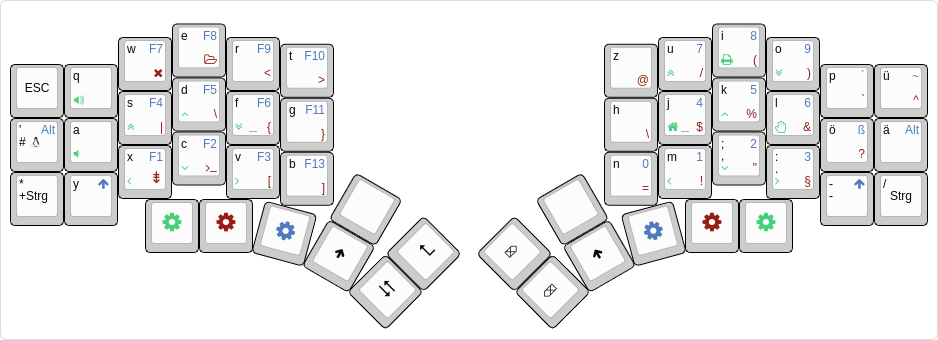

# About

This is a german layout for splitkb kyria rev.3
https://splitkb.com/collections/keyboard-kits/products/kyria-rev3-pcb-kit

## Layout


## Special Features
### Layer 3
#### Left side 
- controlling gnome desktop
- underglow controlls on key w,e,r,t

#### right side
- cursor controlls
- bash history end on key h

### layer 4 (macros and shortcuts)
#### left side (macros)
- key t: phpstorm, wrap in tag
- key r: phpstorm, locate file

#### right side (shortcuts)
- key l: phpstorm, format


## Install
In your qmk firmware folder:
```bash
git submodule add git@github.com:mxsteini/mxsteini_de.git keyboards/splitkb/kyria/keymaps/mxsteini_de
```

## Rebuild

```bash
mv ~/Downloads/mxsteini_de.json keyboards/splitkb/kyria/keymaps/mxsteini_de/mxsteini_de.json
qmk json2c keyboards/splitkb/kyria/keymaps/mxsteini_de/mxsteini_de.json > keyboards/splitkb/kyria/keymaps/mxsteini_de/keymap.c
```

## compile
```bash
qmk compile -kb  splitkb/kyria/rev3  -km mxsteini_de
```

## flash (on liatris)
```bash
qmk flash -kb  splitkb/kyria/rev3  -km mxsteini_de -e CONVERT_TO=liatris
```
